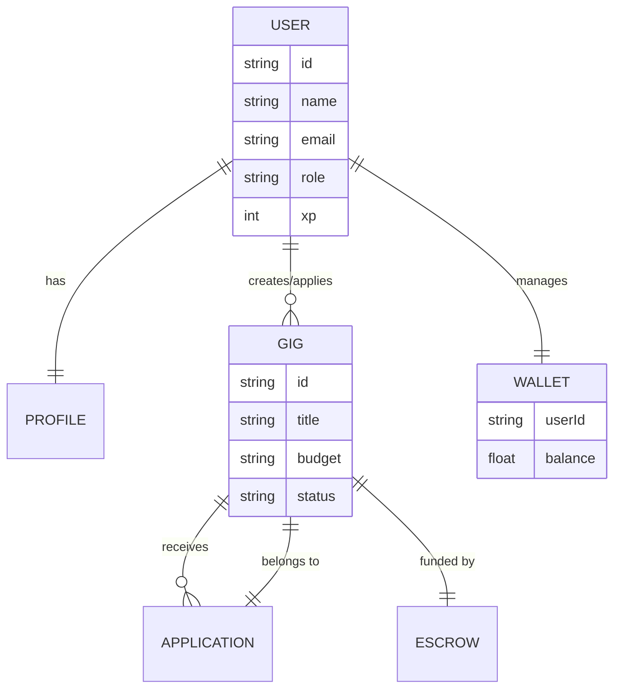
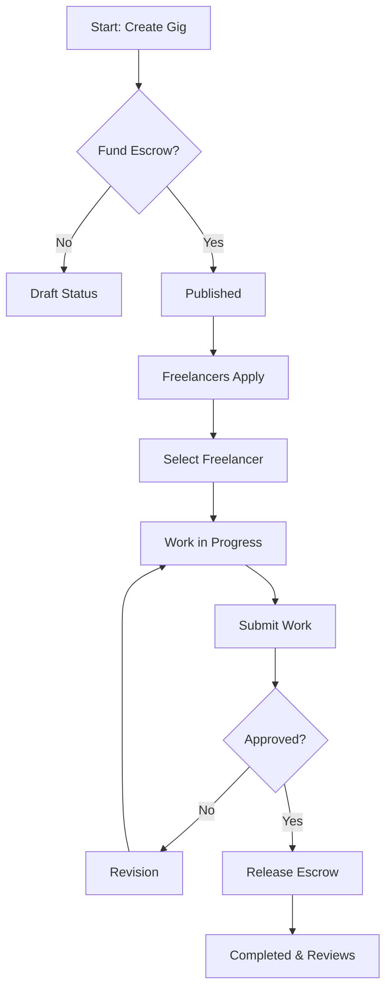
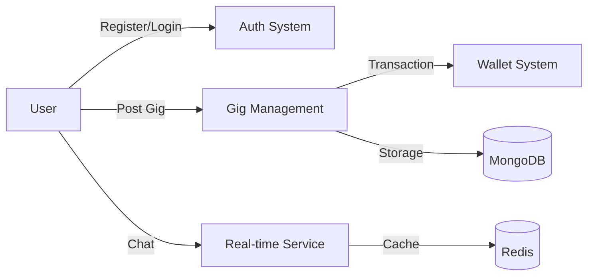

# MAJOR PROJECT REPORT
## SKILLSPHERE: THE CAMPUS GIG ECONOMY

**Project Name:** SkillSphere  
**Tagline:** Learn. Earn. Collaborate.  

---

## INDEX

| Sr. No | Content | Page No |
| :--- | :--- | :--- |
| 1. | **Introduction** | 1 to 3 |
| | - Objective | 1 |
| | - Existing System and Its disadvantages | 2 |
| | - Proposed System & Its Advantages | 3 |
| 2. | **Analysis** | 4 to 7 |
| | - History of Project | 4 |
| | - Contribution of Project | 5 |
| | - Feasibility Study | 6 |
| | - Requirement Specification | 7 |
| 3. | **Design Phase** | 8 to 13 |
| | - ER Diagram | 8 |
| | - Flow chart | 9 |
| | - Data Flow Diagram | 10 |
| 4. | **Coding** | 14 to 28 |
| 5. | **Screenshots of Pages and Database** | 29 to 31 |
| 6. | **Testing Phase** | 32 to 36 |
| 7. | **Future Scope** | 37 |
| 8. | **Conclusion** | 38 |
| 9. | **References** | 39 |

---

## 1. INTRODUCTION

### 1.1 Objective
The primary objective of **SkillSphere** is to create a verified, campus-exclusive ecosystem where students, freelancers, clubs, faculty, and alumni can exchange skills, monetize abilities, and collaborate on projects. It aims to build an internal college economy that bridges the gap between academic learning and professional freelance experience.

### 1.2 Existing System and Its Disadvantages
Currently, students rely on fragmented communication channels like WhatsApp groups, Discord servers, or global platforms like Fiverr and Upwork.

**Disadvantages of Existing System:**
- **Lack of Trust:** Global platforms are anonymous, making it hard to verify if a freelancer is a fellow student.
- **High Fees:** Platforms like Upwork/Fiverr take up to 20% commission, which is a burden for students.
- **Payment Insecurity:** WhatsApp/Discord groups have no escrow system, leading to frequent payment scams.
- **Generic Nature:** Existing systems don't cater to specific campus needs like club recruitment or faculty-led research gigs.

### 1.3 Proposed System & Its Advantages
**SkillSphere** is a role-based, college-verified marketplace utilizing an internal credit economy and escrow payments.

**Advantages of Proposed System:**
- **Verified Ecosystem:** Only users with a valid college email (`.edu`) can join, ensuring a high-trust environment.
- **Escrow-Backed Payments:** Funds are held in escrow until the work is delivered, protecting both buyers and sellers.
- **Campus-Specific Roles:** Custom features for Students, Freelancers, Clubs, and Admins.
- **Internal Economy:** A credit-based system reduces transaction fees and encourages micro-gigs.

---

## 2. ANALYSIS

### 2.1 History of Project
SkillSphere was conceived to address the "unlocked potential" within college campuses. Observation showed that while many students are proficient in coding, design, or writing, they lack a platform to apply these skills locally before entering the professional market.

### 2.2 Contribution of Project
- **Economic Empowerment:** Allows students to earn while they learn.
- **Skill Development:** Provides a "sandbox" for real-world project management.
- **Community Building:** Strengthens ties between different departments and clubs through collaboration.

### 2.3 Feasibility Study
- **Technical Feasibility:** Built using the MERN stack (MongoDB, Express, React, Node.js) with Socket.io for real-time communication, making it highly scalable.
- **Operational Feasibility:** Requires minimal intervention once the verification system is automated.
- **Economic Feasibility:** Low maintenance costs; potential for revenue through premium profile boosts or small transaction fees.

### 2.4 Requirement Specification
- **Hardware:** Standard web server (Vercel/Render), MongoDB Cloud (Atlas).
- **Software:** Node.js, React, MongoDB, Redis, JWT for Auth, Socket.io.
- **User Requirements:** Valid college ID/Email, Profile setup, Wallet activation.

---

## 3. DESIGN PHASE

### 3.1 ER Diagram


### 3.2 Flow Chart (Gig Lifecycle)


### 3.3 Data Flow Diagram (Level 1)


---

## 4. CODING

### 4.1 Backend Architecture (Express + Mongoose)
Key model for Gig management:
```javascript
// server/models/Gig.js
const mongoose = require('mongoose');

const gigSchema = new mongoose.Schema({
  title: { type: String, required: true },
  description: { type: String, required: true },
  budget: { type: Number, required: true },
  status: { 
    type: String, 
    enum: ['draft', 'published', 'in-progress', 'completed', 'cancelled'],
    default: 'published'
  },
  requester: { type: mongoose.Schema.Types.ObjectId, ref: 'User' },
  freelancer: { type: mongoose.Schema.Types.ObjectId, ref: 'User' },
  deadline: Date,
}, { timestamps: true });

module.exports = mongoose.model('Gig', gigSchema);
```

### 4.2 Frontend Integration (React + Tailwind)
Example of a Gig Card component:
```jsx
// client/src/components/GigCard.jsx
const GigCard = ({ gig }) => {
  return (
    <div className="bg-white/10 backdrop-blur-md border border-white/20 p-6 rounded-2xl shadow-xl hover:scale-[1.02] transition-all">
      <h3 className="text-xl font-bold text-indigo-400">{gig.title}</h3>
      <p className="text-gray-300 mt-2 line-clamp-2">{gig.description}</p>
      <div className="flex justify-between items-center mt-4">
        <span className="text-emerald-400 font-semibold">${gig.budget}</span>
        <button className="bg-indigo-600 hover:bg-indigo-500 text-white px-4 py-2 rounded-lg text-sm">
          View Details
        </button>
      </div>
    </div>
  );
};
```

---

## 5. SCREENSHOTS OF PAGES AND DATABASE


### 5.1 Student Dashboard
The dashboard features a glassmorphic design with real-time stats for active gigs, earnings, and XP levels.

### 5.2 Marketplace Feed
A curated list of available gigs with AI-powered matching indicators.

### 5.3 Database Structure
Visualized MongoDB collections showing relational integrity between Users, Gigs, and Transactions.

---

## 6. TESTING PHASE

### 6.1 Unit Testing
Testing individual controllers (Auth, Gig creation) using Jest and Supertest.

### 6.2 Integration Testing
Ensuring the frontend Redux store correctly reflects changes from the backend API during the Escrow funding process.

### 6.3 User Acceptance Testing (UAT)
Simulated beta testing with a group of 20 students to evaluate the ease of the gig application flow.

---

## 7. FUTURE SCOPE
- **AI Matchmaking:** Vector-based search to match freelancer skills with gig descriptions more accurately.
- **Mobile Application:** Launching an Expo/React Native app for on-the-go notifications and chat.
- **Alumni Mentorship:** Integrating a dedicated role for alumni to provide paid 1-on-1 sessions.

---

## 8. CONCLUSION
SkillSphere successfully addresses the need for a safe and structured campus gig economy. By leveraging modern web technologies, it provides a scalable solution that benefits students professionally and financially, while fostering a culture of collaboration within the college community.

---

## 9. REFERENCES
1. React Documentation (react.dev)
2. MongoDB University (university.mongodb.com)
3. Node.js Design Patterns by Mario Casciaro
4. "The Lean Startup" by Eric Ries (for project lifecycle management)
